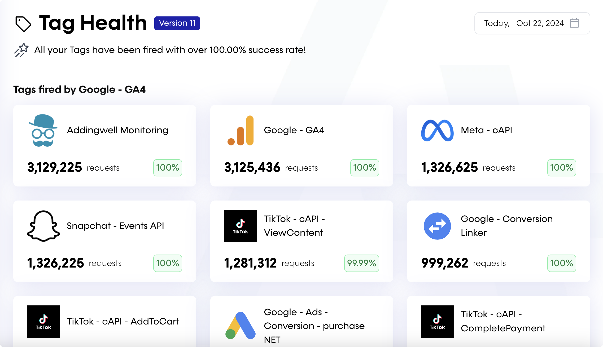
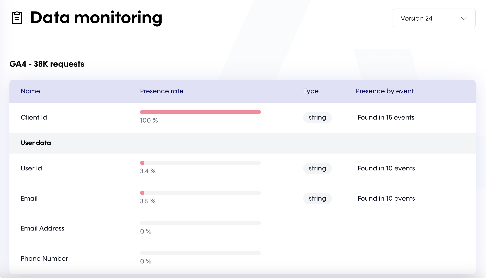

# Addingwell Monitoring Tag

This tag allows you to monitor your live tagging server, ensuring everything runs smoothly after going live. This Addingwell feature helps detect and resolve server-side tagging issues promptly.

## Background

Observing activity while previewing your server container is easy, but once your server-side setup is live, it's crucial to continuously monitor and ensure everything is functioning properly. This tag was designed specifically for this purpose, helping our clients detect any server-side tracking issues.

## How does the Addingwell Monitoring tag work?

You must have your GTM ServerSide infrastructure on Addingwell to use this feature.

Register here for a free trial : https://app.addingwell.com/signup

This tags saves anonymized data to BigQuery, to power the Addingwell Monitoring feature.

This allows you to control :
- Your clients and tags, with <b>Tag Health</b>, and seeing what is trigger, and their performance

- Your common event data, with <b>Data Monitoring</b>, and ensure their quality

## Implementation

You can follow our [step-by-step instructions](https://docs.addingwell.com/configure-tag-health-gtm-server-side).
